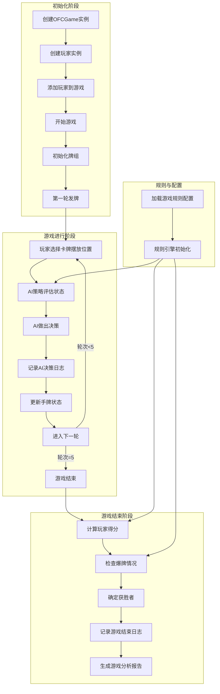

# OFCGame 架构文档

## 1. 模块图

### 核心模块结构

```
OFCProject/
 │
 ├── core/               # 核心游戏逻辑与规则
 │   ├── rules.py        # 规则引擎：评估、比较、计分、幻想模式
 │   ├── hand_state.py   # 玩家手牌集中管理，保证不变式
 │   ├── logger.py       # 日志记录模块
 │   ├── analyzer.py     # 统计分析模块
 │   └── constants.py    # 规则参数、计分配置（已被YAML配置替代）
 │
 ├── config/             # 配置层
 │   ├── game_rules.yaml # 游戏规则配置文件
 │   └── loader.py       # 配置加载器
 │
 ├── game/               # 游戏流程与对局管理
 │   ├── ofc_game.py     # OFCGame 类，负责发牌、轮次、玩家调用规则接口
 │   ├── player.py       # 玩家类（Human/AI），持有 HandState
 │   └── deck.py         # 扑克牌组与发牌逻辑
 │
 ├── ai/                 # AI 与博弈模块
 │   ├── ai_player.py    # AIPlayer，调用策略接口
 │   ├── mcts.py         # MCTS 树搜索
 │   └── strategy.py     # AIStrategy 抽象类 + 启发式策略实现
 │
 ├── tests/              # 测试用例
 │   ├── test_rules.py
 │   ├── test_game_flow.py
 │   └── test_ai.py
 │
 ├── docs/               # 文档
 │   ├── architecture.md # 架构文档
 │   └── rules.md        # 规则说明
 │
 ├── logs/               # 游戏日志
 │
 ├── analysis/           # 分析报告和可视化图表
 │
 └── run_tests.py        # 持续集成测试脚本
```

### 模块职责说明

| 模块 | 主要职责 | 文件位置 |
|------|---------|----------|
| 规则引擎 | 手牌评估、比较、计分、幻想模式判断 | core/rules.py |
| 手牌状态 | 集中管理玩家手牌，保证区域长度不变式 | core/hand_state.py |
| 日志记录 | 记录游戏过程、AI决策、手牌状态、得分 | core/logger.py |
| 统计分析 | 分析游戏数据、生成报告、可视化图表 | core/analyzer.py |
| 配置加载 | 加载和管理游戏规则配置 | config/loader.py |
| 游戏流程 | 管理游戏流程、发牌、轮次、胜负判定 | game/ofc_game.py |
| 玩家管理 | 玩家属性和行为管理 | game/player.py |
| 牌组管理 | 卡牌和牌组管理、发牌逻辑 | game/deck.py |
| AI策略 | AI决策接口和实现 | ai/strategy.py |
| MCTS算法 | 蒙特卡洛树搜索实现 | ai/mcts.py |

## 2. 数据流图

### 游戏流程数据流



### 核心数据流向

1. **配置数据**：从 `config/game_rules.yaml` 加载，通过 `config/loader.py` 提供给规则引擎
2. **游戏状态数据**：在 `game/ofc_game.py` 中管理，包括玩家列表、当前轮次、牌组状态
3. **手牌数据**：在 `core/hand_state.py` 中集中管理，保证区域长度不变式
4. **决策数据**：AI 策略通过 `ai/strategy.py` 评估游戏状态并做出决策
5. **日志数据**：通过 `core/logger.py` 记录游戏过程和AI决策
6. **分析数据**：通过 `core/analyzer.py` 分析日志数据并生成报告

## 3. 架构设计原则

### 3.1 关注点分离

- **规则与流程分离**：规则引擎负责评估、比较、计分等核心规则，游戏流程负责管理游戏状态和轮次
- **状态与行为分离**：手牌状态集中管理，保证不变式，玩家行为通过方法调用修改状态
- **策略与实现分离**：AI策略通过抽象接口定义，具体实现可插拔

### 3.2 可扩展性

- **配置化规则**：游戏规则通过YAML配置文件定义，支持不同规则集
- **可替换策略**：AI策略通过抽象接口定义，支持不同的决策算法
- **可扩展日志**：日志系统支持自定义输出格式和存储方式
- **可扩展分析**：分析系统支持自定义分析维度和可视化图表

### 3.3 可维护性

- **集中状态管理**：手牌状态集中管理，减少状态不一致的风险
- **统一接口**：规则引擎提供统一的评估、比较、计分接口
- **模块化设计**：功能模块化，职责清晰，便于维护和测试
- **完善的测试**：单元测试和集成测试覆盖核心功能
- **详细的日志**：记录游戏过程和AI决策，便于调试和分析

## 4. 核心接口说明

### 4.1 规则引擎接口

| 方法 | 描述 | 参数 | 返回值 |
|------|------|------|--------|
| evaluate_hand | 评估手牌强度 | cards: 手牌列表 | 强度值 |
| compare_hands | 比较两手牌大小 | hand1, hand2: 手牌列表 | 1/-1/0 |
| check_busted | 检查玩家是否爆牌 | player: 玩家对象 | bool |
| calculate_hand_score | 计算牌型分 | cards: 手牌列表, region: 区域名称 | 得分 |
| check_fantasy_mode | 检查是否进入幻想模式 | player: 玩家对象 | bool |

### 4.2 游戏流程接口

| 方法 | 描述 | 参数 | 返回值 |
|------|------|------|--------|
| start_game | 开始游戏 | 无 | 无 |
| deal_first_round | 第一轮发牌 | 无 | 无 |
| next_round | 进入下一轮 | 无 | bool |
| calculate_total_score | 计算玩家总得分 | player: 玩家对象 | 得分 |
| determine_winner | 确定游戏获胜者 | 无 | 获胜玩家对象 |

### 4.3 AI策略接口

| 方法 | 描述 | 参数 | 返回值 |
|------|------|------|--------|
| decide_placement | 决定卡牌摆放 | hand_state: 手牌状态 | 摆放后的手牌状态 |
| choose_action | 选择行动 | player: 玩家对象, game: 游戏对象 | 行动元组 |
| evaluate_state | 评估状态 | player: 玩家对象, game: 游戏对象 | 状态价值 |

### 4.4 日志记录接口

| 方法 | 描述 | 参数 | 返回值 |
|------|------|------|--------|
| start_game | 开始记录新游戏 | game: 游戏对象 | 无 |
| record_round | 记录每轮游戏 | game: 游戏对象, round_num: 轮次, actions: 玩家动作 | 无 |
| record_ai_decision | 记录AI决策 | player_name: 玩家名称, decision: 决策内容, hand_state: 手牌状态, score: 得分 | 无 |
| end_game | 结束游戏并记录结果 | game: 游戏对象, winner: 获胜玩家 | 无 |
| analyze_game | 分析游戏日志 | game_id: 游戏ID | 分析结果 |

### 4.5 统计分析接口

| 方法 | 描述 | 参数 | 返回值 |
|------|------|------|--------|
| load_game_logs | 加载所有游戏日志 | 无 | 游戏日志列表 |
| analyze_ai_decisions | 分析AI决策模式 | game_logs: 游戏日志列表 | AI决策分析结果 |
| analyze_hand_states | 分析手牌状态分布 | game_logs: 游戏日志列表 | 手牌状态分析结果 |
| analyze_score_trends | 分析得分变化趋势 | game_logs: 游戏日志列表 | 得分趋势分析结果 |
| generate_statistics_report | 生成统计报告 | output_dir: 报告输出目录 | 报告文件路径 |
| find_bugs | 查找潜在的bug | game_logs: 游戏日志列表 | 潜在bug列表 |

## 5. 技术栈与依赖

| 技术/依赖 | 用途 | 版本要求 |
|-----------|------|----------|
| Python | 主要开发语言 | 3.7+ |
| PyYAML | 解析YAML配置文件 | 6.0+ |
| NumPy | 数值计算和统计分析 | 1.20+ |
| Matplotlib | 数据可视化 | 3.5+ |
| unittest | 单元测试框架 | 内置 |
| logging | 日志记录 | 内置 |
